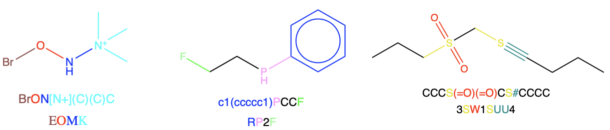

# Wiswesser Line Notation (WLN) Chemical Converter

* WLN Parser               - read and write WLN to/from smiles, inchi, mol files and other chemical line notations.  <br>
* WLN FSM                  - extract chemical terms from documents, this machine uses greedy matching to return matched WLN sequences from documents.  <br>

This is Linux and MacOS software only. <br>
Tools are designed to be piped together and therefore will take `stdin` by default. <br> 



## Requirements

A chemical toolkit, either **OpenBabel** [see repo](https://github.com/openbabel/openbabel) or **RDKit** [see repo](https://github.com/rdkit/rdkit). These can be installed into $PATH, or one directory level up from this project if building from source without a global install. 


## Build

This project uses **cmake** and **make** for building. Standard CMake build applies, 
```
mkdir build
cd build
cmake ..
make -j10
```

# Converting between WLN and CLN Formats 


`readwln` - This takes WLN sequences and returns the desired format.  <br>
`writewln` - This takes CLN sequences and returns WLN strings.  <br>

`-h` - display the help menu <br>
`-o`|`-i` - choose output|input format for string, options are `-osmi`, `-oinchi`, `-okey` (inchikey) and `-ocan` following OpenBabels format conventions <br>


## Wiswesser Conversion Release Notes

The following are sections from Elbert G. Smiths rule book that were used to create the wln reader. Note that not all chapters are listed here, only the ones where compound types were introduced.

Please note that the "MANTRAP" rules, are not officialy given in either volume of the offical Wiswesser manuals, as such, implementation is tricky at best. For this parser, they will not be supported. 

| Rule | Read | Write |
| ---- | ---- | ---- |
|Unbranched and Branched Chains | :heavy_check_mark: | :heavy_check_mark: | 
|Systematic Contractions | :heavy_check_mark: | :heavy_check_mark: |
|Organic Salts | :heavy_check_mark: | :heavy_check_mark: |
|Benzene Derivatives | :heavy_check_mark: | :heavy_check_mark: |
|Multisubstituted Benzene Rings | :heavy_check_mark: | :heavy_check_mark: |
|Benzene Rings in Branching Chains | :heavy_check_mark: | :heavy_check_mark: |
|Monocyclic Rings | :heavy_check_mark: | :heavy_check_mark: |
|Bicyclic Rings | :heavy_check_mark: | :heavy_check_mark: |
|Polycyclic Rings | :heavy_check_mark: | :heavy_check_mark: |
|Perifused Rings | :heavy_check_mark: | :heavy_check_mark: |
|Chains of Rings other than Benzene | :heavy_check_mark: | :heavy_check_mark: |
|Sprio Rings | :heavy_check_mark: | :heavy_check_mark: |
|Bicyclic Bridged Rings |:heavy_check_mark: | :heavy_check_mark: |
|Rings with Pseudo Bridges | :heavy_check_mark: | :heavy_check_mark: |  
|Ring Structures with Crossed Bonds and Unbranched Bridges | :heavy_check_mark: | :heavy_check_mark: |
|Rings of Rings Contraction | :heavy_check_mark: |  | 
|Metallocenes and Catanenes | :heavy_check_mark: | :heavy_check_mark: |
|Chelete Compounds | :heavy_check_mark: | :heavy_check_mark: |
|Ionic Charges, Free Radicals and Isotopes | :heavy_check_mark: | :heavy_check_mark: |
|Multipliers | | |
|Ring Contractions and Multipliers | | |
|All Special Problems Rules | | |


# WLN Extraction 

Grep-style tool for extracting WLN strings from text. 

```
wlngrep <options> <filename>
```

#### Flags 

`-c` - return number of matches instead of string <br>
`-o` - print only the matched parts of line <br>
`-x` - return string if whole line matches <br>
`-v` - invert matching <br> 
